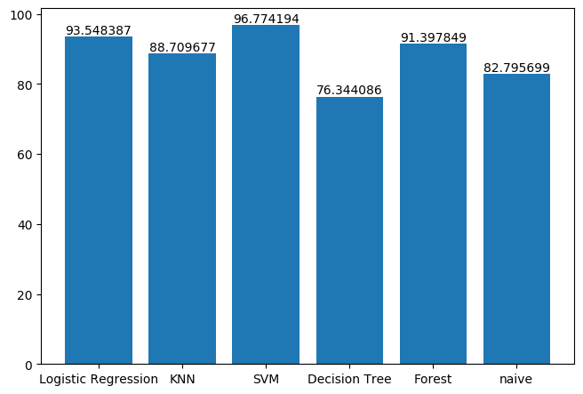
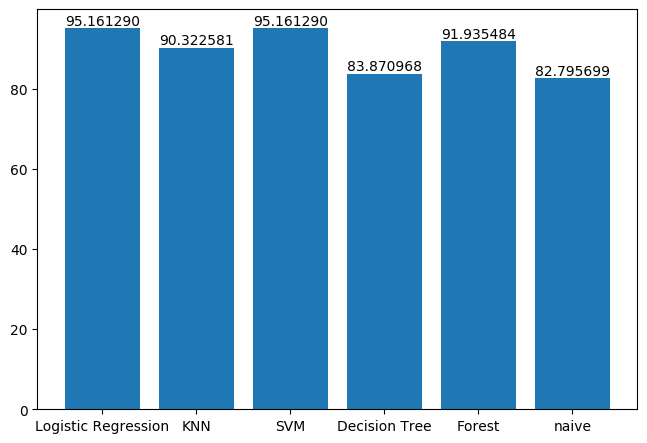
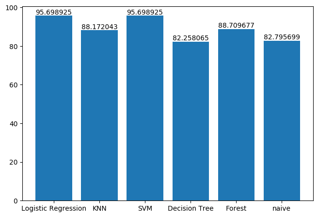
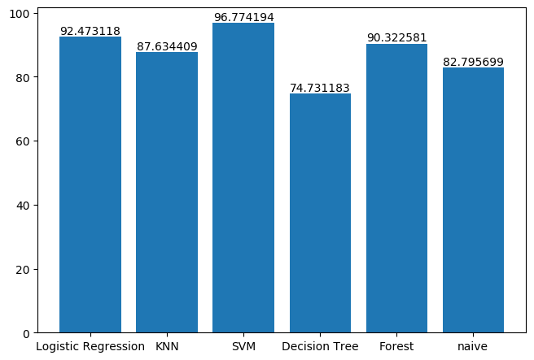

# InterviewSelectionPrediction

I am in college and I need to know which skills on my resume will gurantee me an Interview, sound's great right?
So I tried to correctly predict that will my resume be selected for interview If I have some particular skills.

### Introduction
In Hiring By Machine, a fictional case study from the Princeton Dialogues on AI and Ethics, developers at the company Strategeion create a machine learning system called PARiS to automatically rank job applicants based on the content of their resumes.

### Factors Affecting Selection
Along with skills there were some other features in data which can affect the selection.
1. Veteran: 1 if the applicant is a veteran, 0 otherwise
2. Female: 1 if the applicant is female, 0 otherwise
3. URM: 1 if the applicant is an underrepresented minority, 0 otherwise
4. Disability: 1 if the applicant has a disability, 0 otherwise

All these factors can affect the selection of a candidate

### Performance of Various Algorithms

1. Comparision of accuracy with only gender feature and all the skills features

2. Comparision of accuracy with only Veteran status feature and all the skills features

3. Comparision of accuracy with all the features 

4. Comparision of accuracy with only skills features

Now I don't want that Machine reject an application on the basis of Gender, Disability, minority status or veteran status. Let's keep that control in the hands of HR.

### Picking up correct Model

So we select the model which have highest accuracy with only skills features and that is Kernel SVM with RBF kernel

### Explaining Files

1. MainModel.ipynb - Main Model developed using Kernel SVM (rbf)
2. MineSkills.csv - contains mine skills that is used to predict if I will get an Interview	
3. ModelSelection-All.ipynb - deciding which model to use when all the features are used
4. ModelSelection-experience.ipynb	- deciding which model to use when all the skills features and Veteran is used
5. ModelSelection-skills.ipynb	- deciding which model to use when all the skills are used
6. ModeleSelection-Gender.ipynb - deciding which model to use when all the skills features and Gender is used
7. columnNames.csv - It contains names of all the skills
8. plotAll.png	- bar chart for all features model
9. plotGender.png	- bar chart for all skills and gender feature model
10. plotSkills.png	- bar chart for all skills model
11. plotVeteran.png	- bar chart for all skills and Veteran feature model
12. resumes_development.csv - Our main data

### Acknowledgements
1. Artificial data generated by Vinesh Kannan https://www.kaggle.com/vingkan/strategeion-resume-skills
2. Inspired by Case Study 5: Hiring By Machine from the Princeton Dialogues on AI and Ethics https://aiethics.princeton.edu/wp-content/uploads/sites/587/2018/12/Princeton-AI-Ethics-Case-Study-5.pdf
